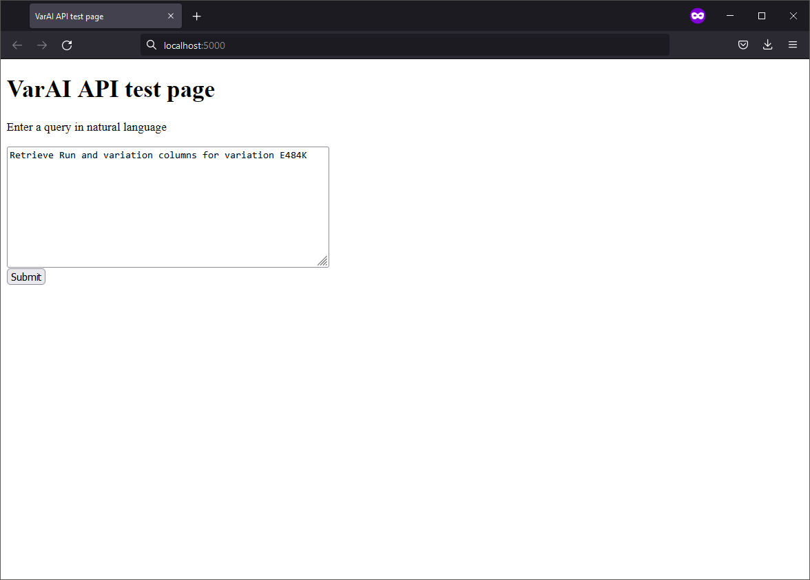

# VarAi

List of participants and affiliations:

- Lon Phan, NCBI (Team Leader)
- Chelsea Alvarado, NIA Center for Alzhemier's and Related Dementias/ Data Tecnica International LLC
- Eugene Shekhtman, NCBI
- Hua Zhang, NCBI
- Zhanni Lu, UMN
- Ricardo V., NCBI

## Project Goals

This project aims to use the ACTIV Variant Call Format (VCF) as input to train a domain-specific GPT language model that specializes in providing accurate and relevant information about viral genetics. The model will be trained using a curated dataset of variants, sequence information, genes, and other annotations. The goal is to create an intelligent conversational agent that can assist users in understanding and exploring various aspects of virus genetics and enhance the exploration and retrieval of genetic variation data. This will be an intuitive and user-friendly Variation AI (VarAI) application for researchers and clinicians to query and retrieve genetic variation information using natural language queries instead of traditionally structured searches (ie. SQL and tool-specific search rules and formats). VarAi, as a domain-specific ChatGPT model that can learn from VCF, can serve as a general framework or tool to generate domain-specific GPT models for any input VCF from any organism.

Goals The main objectives of this project are as follows:

- Train a ChatGPT model to understand and generate responses specific to human genetic information.
- Fine-tune the model using a comprehensive dataset including variants, genetic sequences, annotations, genes, viral data, and other metadata (geographic, patient information, etc.).
- Develop domain-specific prompts and guidelines to ensure accurate and relevant responses.
- Evaluate the performance of the model through iterative training and validation processes.
- Create a user-friendly interface to interact with the trained ChatGPT model and provide access to genetic information.

## Approach (Lon)

### Data

**VCF** (Lon)
**External data - Gene, Pubmed, etc.** (Polycarp or Chey)

### VarAI app (Chelsea)

A web application for general users to query the data using NLP.

### Jupyter Notebook (Zhanni, Ricardo)

[`Notebooks/test-model.ipynb`](./Notebooks/test-model.ipynb) is a sample
notebook for data analysts and Bioinformatics scientists to test code snippets,
visualize data, and immediately see the results.

**Note** At the moment, only these two queries are understood:

- Retrieve Run and variation columns for variation E484K
- variant at position 27513

The conversion from natural language (NL) to SQL is simulated.

### Backend (Ricardo)

The [`api`](./api) directory contains the code for a basic Flask app that
queries an Athena backend that has the contents of the VCF files in this
Codeathon. The app returns results in CSV format. Only the first 1000 results
are retrieved, currently.

**Note** Only the two queries supported by the notebook are understood here.
Converting NL to SQL is also simulated.

### GDV data tracks (Zhanni)

TBW

### GPT model (Hua, Chey, and Gene)

Evaluate and demonstrate using `langchain` with Open Source Llama model(s), so that users do not need to use paid GPT models. Sample code is in `langchain` directory. Instructions on quantizing models is under the [`doc`](./doc) directory.

## Results

TBW

## Future Work

TBW
